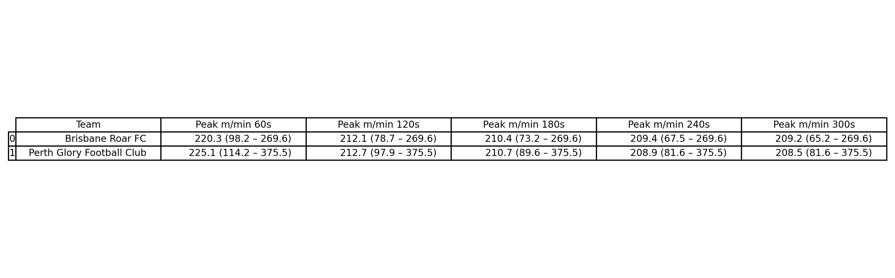

# SkillCorner X PySport Analytics Cup
This repository contains [Emaly Vatne's](https://emalyvatne.github.io/) submission for the SkillCorner X PySport Analytics Cup **Research Track**. :)

## Contextualizing Worst-Case Scenario Running Demands by Identifying Associated In-Game Events and Movement Sequences in Soccer to Inform Physical Preparation and Tactical Development

### Introduction  
While external load metrics from match play are ubiquitously used to support physical preparation in soccer (1), they are often reported as aggregated values across a match, obscuring the worst-case scenario (WCS) demands. WCS demands represent the highest locomotor intensities experienced over short rolling windows and better reflect peak match demands than whole-match averages (2,3). Because injury, increased fatigue, and technical breakdowns can occur during these peak periods, preparing players for WCS demands is important for effective training design. Despite growing interest in WCS metrics (3), these demands are rarely contextualized within the game, limiting their value to coaches. It remains unclear which technical or tactical events precede WCS demands and how movement sequences can be translated into sport-specific conditioning. Therefore, the purpose of this study was to contextualize WCS running demands by identifying preceding in-game events and reconstructing movement sequences to inform tactical teaching and physical preparation.  

### Methods  
Optical tracking data from a randomly selected professional soccer match for which tracking and event data were openly available (Brisbane Roar FC vs. Perth Glory FC on 2024-12-21; `match_id` = 1925299) was analyzed for the development of this reusable tool. WCS running demands were calculated using a rolling moving-average approach across 1-, 2-, 3, 4, and 5-minute windows. For each player, WCS windows were extracted and temporally aligned with event data using timestamps and frame counts. Events occurring prior to each WCS window were merged with the start of each WCS demand period by matching the frame count and player Id. Finally, player trajectories and speed profiles during WCS windows were then reconstructed to characterize individual movement sequences. 

### Results
This submission provides a generalizable Jupyter Notebook that calculates WCS demands from *SkillCorner* tracking data, merges them with preceding in-game dynamic events on a player-specific basis, and visualizes movement sequences during WCS periods for a selected player, allowing the workflow to be applied across matches. 

In the match analzyed for the development of the reusable tool, the peak running intensity increased as window duration shortened, with the highest demands observed during 30-second and 1-minute windows, consistent with previous literature (2,3). 

Additionally, common preceding events differed across players and positions, with WCS demands emerging from contexts including defensive off-ball runs and on-ball engagements. 

Movement sequence analysis revealed substantial inter-individual variability in how peak demands were accumulated despite similar running intensities. This part of the Notebook supports the design of conditioning drills that replicate the locomotor demands of WCS demands periods. Additionally, the visualization demonstrates that **WCS demands/peak running intensities are rarely linear and in the same speed** and thus training should adjust accordingly to be sport-specific. 

### Conclusion  
This workflow provides coaches and performance practitioners with interpretable, context-driven WCS demand calculations and insights. By linking peak running loads to tactical events and reconstructing movement sequences, it enhances collaboration across departments and informs individualized, game-model-aligned training prescriptions. The notebook offers a scalable tool that can be repeatedly applied across matches to support ongoing monitoring, tactical evaluation, and readiness-based decision-making in elite soccer.

## How to Run the Code  

1. Prerequisites  
2. Install Pipenv  
3. Set up the environment  
4. Open the notebook  
   Launch `submission.ipynb` and choose the Python kernel created by Pipenv.  
5. Run the notebook  
   Select the match(es) that you wish to analyze. 
   For the movement sequences visualization, select the player and window duration and then hit Play.  

## References  
1. Halson, S. L. (2014). Monitoring Training Load to Understand Fatigue in Athletes. Sports Medicine, 44(S2), 139–147. https://doi.org/10.1007/s40279-014-0253-z

2. Oliva-Lozano, J. M., Rojas-Valverde, D., Gómez-Carmona, C. D., Fortes, V., & Pino-Ortega, J. (2020). Worst case scenario match analysis and contextual variables in professional soccer players: A longitudinal study. Biology of Sport, 37(4), 429–436. https://doi.org/10.5114/biolsport.2020.97067

3. Lobo-Triviño, D., García-Calvo, T., Polo-Tejada, J., Sanabria-Pino, B., López del Campo, R., Nevado-Garrosa, F., & Raya-González, J. (2025). Analyzing Positional and Temporal Variations in Worst-Case Scenario Demands in Professional Spanish Soccer. Journal of Functional Morphology and Kinesiology, 10(2), 172. https://doi.org/10.3390/jfmk10020172